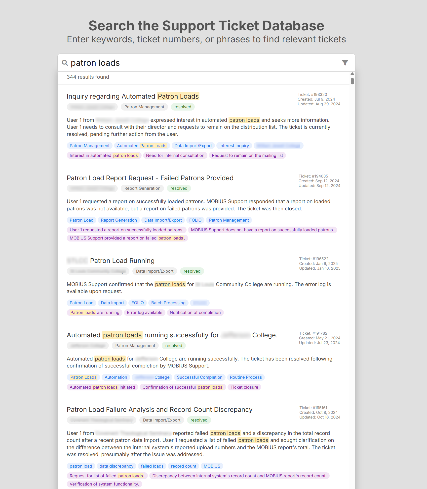
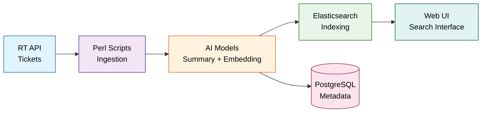

<div align="center">

# RT Search Application

### AI-Powered Semantic Search for Request Tracker Tickets

[](https://rtaisearch.searchmobius.org)
[](LICENSE)
[](https://mobiusconsortium.org)




*Intelligent ticket search combining semantic understanding, AI-generated summaries, and traditional keyword matching*

[Features](#features) • [Quick Start](#quick-start) • [Architecture](#architecture) • [Documentation](#documentation) • [Contributing](#contributing)

</div>

---

## Table of Contents

- [Overview](#overview)
- [Features](#features)
- [Architecture](#architecture)
  - [Infrastructure](#infrastructure)
  - [Data Flow](#data-flow)
- [Quick Start](#quick-start)
- [Prerequisites](#prerequisites)
- [Installation](#installation)
- [Configuration](#configuration)
- [Usage](#usage)
  - [Data Processing](#data-processing)
  - [Web Interface](#web-interface)
  - [API Endpoints](#api-endpoints)
- [Development](#development)
- [Deployment](#deployment)
- [Monitoring](#monitoring)
- [Troubleshooting](#troubleshooting)
- [Contributing](#contributing)
- [Documentation](#documentation)
- [License](#license)

---

## Overview

The RT Search Application is a sophisticated multi-component system that provides **AI-powered search functionality** for Request Tracker tickets. It combines semantic search, keyword matching, and AI-generated summaries to deliver comprehensive ticket analysis and retrieval capabilities.

---

## Features

<table>
<tr>
<td width="50%">

### Search Capabilities
- **Semantic Search** - Natural language understanding using vector embeddings
- **Keyword Search** - Traditional Elasticsearch-powered text search
- **Hybrid Mode** - Combines both approaches for optimal results
- **Direct Lookup** - Find tickets instantly by ID (`#12345`)
- **Faceted Filtering** - Narrow results by category, status, and queue

</td>
<td width="50%">

### AI Intelligence
- **Auto-Summarization** - Google Gemini & OpenAI powered ticket summaries
- **Smart Categorization** - Automatic classification of ticket types
- **Sentiment Analysis** - Understand ticket urgency and tone
- **Vector Embeddings** - Ollama's Nomic model for semantic understanding
- **Real-time Processing** - Automated ingestion pipeline

</td>
</tr>
<tr>
<td width="50%">

### User Experience
- **Modern UI** - Responsive Angular 19 interface
- **Fast Results** - Sub-second search response times
- **Rich Previews** - See ticket summaries and metadata at a glance
- **Mobile-Friendly** - Works seamlessly on all devices

</td>
<td width="50%">

### Developer Features
- **RESTful API** - Clean JSON endpoints for integration
- **Docker Support** - Containerized deployment options
- **Distributed Architecture** - Scalable multi-VM design
- **Comprehensive Logging** - Full audit trail and debugging

</td>
</tr>
</table>

---

## Architecture

### Infrastructure

The application uses a **distributed architecture** across two VMs for optimal performance and resource utilization:

<table>
<tr>
<th width="50%">Local VM (Hyper-V)</th>
<th width="50%">Cloud VM (Google Cloud)</th>
</tr>
<tr>
<td>

**Purpose**: Data processing and embedding generation

- **Location**: 192.168.11.164
- **Services**:
  - PostgreSQL database
  - Ollama embedding engine
  - Perl processing pipeline
- **Resources**: 16 CPU, 8GB RAM
- **OS**: Ubuntu 24.04

</td>
<td>

**Purpose**: Search interface and data serving

- **Location**: 34.172.8.54
- **Services**:
  - Elasticsearch cluster
  - Node.js API server
  - Angular frontend
- **Resources**: 2 CPU, 4GB RAM
- **OS**: Ubuntu 24.04

</td>
</tr>
</table>

### Data Flow



**Processing Pipeline**:
1. **Ingestion** - Perl scripts fetch tickets from Request Tracker API
2. **AI Analysis** - Google Gemini/OpenAI generate summaries and classifications
3. **Embedding** - Ollama Nomic model creates 768-dimensional semantic vectors
4. **Storage** - Metadata in PostgreSQL, full-text index in Elasticsearch
5. **Search** - Hybrid query engine combines semantic + keyword search

---

## Quick Start

### Prerequisites

<details>
<summary><strong>System Requirements</strong> (click to expand)</summary>

- Ubuntu 22.04 LTS or later
- Perl 5.3x with CPAN modules
- Node.js 18+
- PostgreSQL 13+
- Elasticsearch 7.x+
- Ollama with nomic-embed-text model
- Angular 19+

</details>

<details>
<summary><strong>Required API Keys</strong> (click to expand)</summary>

- Request Tracker credentials (username + password)
- OpenAI API key (for GPT summaries)
- Google Gemini API key (for alternative AI processing)

</details>

### Installation

**1. Clone the repository**
```bash
git clone https://github.com/mcoia/rt-search-app.git
cd rt-search-app
```

**2. Install system dependencies**
```bash
sudo apt update
sudo apt install libpq-dev perl postgresql
```

**3. Install Perl modules**
```bash
cpan LWP::UserAgent JSON DBIx::Simple SQL::Abstract \
     MIME::Base64 Data::Dumper Try::Tiny HTTP::Request DBD::Pg
```

**4. Install Node.js dependencies**
```bash
cd resources/html/server && npm install
cd ../frontend && npm install
cd ../../..
```

**5. Setup PostgreSQL database**
```bash
sudo -u postgres psql
```
```sql
CREATE DATABASE request_tracker;
CREATE USER rtuser WITH ENCRYPTED PASSWORD 'your_password';
GRANT ALL PRIVILEGES ON DATABASE request_tracker TO rtuser;
\q
```
```bash
psql -U rtuser -d request_tracker -f resources/sql/schema.sql
```

**6. Install and configure Ollama**
```bash
curl -fsSL https://ollama.com/install.sh | sh
ollama pull nomic-embed-text:latest
systemctl enable ollama && systemctl start ollama
```

**7. Setup Elasticsearch**
```bash
docker pull docker.elastic.co/elasticsearch/elasticsearch:7.17.0
docker run -d --name elasticsearch \
  -p 9200:9200 \
  -e "discovery.type=single-node" \
  docker.elastic.co/elasticsearch/elasticsearch:7.17.0
```

**8. Configure application**
```bash
cp rt.conf.example rt.conf
# Edit rt.conf with your credentials and API keys
```

**9. Run the application**
```bash
# Start ticket processing
perl rt.pl

# In another terminal, start web server
cd resources/html/server
node rt-app.js
```

**10. Access the interface**

Open your browser to `http://localhost:10000`

---

## Configuration

<details>
<summary><strong>Main Configuration File</strong> - <code>rt.conf</code> (click to expand)</summary>

```ini
# Request Tracker API Configuration
user = your_rt_username
pass = your_rt_password
domain = https://your-rt-domain.com

# Database Configuration
dbname = request_tracker
host = localhost
port = 5432
username = rtuser
password = your_db_password

# AI Service API Keys
openai_key = sk-your-openai-api-key
gemini_ai_key = your-gemini-api-key

# Service Endpoints
es_url = http://localhost:9200
nomic_ai_url = http://localhost:11434

# Processing Options
batch_size = 100
max_retries = 3
embedding_model = nomic-embed-text:latest
```

</details>

<details>
<summary><strong>Frontend Configuration</strong> (click to expand)</summary>

Update API endpoint in `resources/html/frontend/src/environments/environment.ts`:

```typescript
export const environment = {
  production: false,
  apiUrl: 'http://localhost:10000/api'
};
```

</details>

<details>
<summary><strong>Elasticsearch Index Settings</strong> (click to expand)</summary>

The application automatically creates indexes with these settings:
- Shards: 1
- Replicas: 0 (single-node setup)
- Analyzers: Standard + keyword
- Vector dimensions: 768 (Nomic embeddings)

</details>

---

## Usage

### Data Processing

```bash
# Full ticket processing pipeline
perl rt.pl

# Process specific ticket range
perl rt.pl --start-id=12345 --end-id=12400

# Test individual components
perl test.pl
```

### Web Interface

**Access Points**:
- **Development**: `http://localhost:10000`
- **Production**: `https://rtaisearch.searchmobius.org`

**Search Capabilities**:
- Direct ticket lookup: `#12345` or `12345`
- Natural language: `patron load issues from last month`
- Keyword search: `database error`
- Filtered search: Use sidebar facets for category, status, queue

### API Endpoints

<details>
<summary><strong>POST /api/search</strong> - Perform hybrid search (click to expand)</summary>

**Request**:
```json
{
  "query": "patron authentication problems",
  "limit": 20,
  "offset": 0,
  "filters": {
    "category": "Authentication",
    "status": "resolved"
  }
}
```

**Response**:
```json
{
  "total": 42,
  "results": [
    {
      "id": "12345",
      "subject": "Patron login failure",
      "summary": "User unable to authenticate...",
      "category": "Authentication",
      "score": 0.89,
      "created": "2024-07-15T10:30:00Z"
    }
  ]
}
```

</details>

<details>
<summary><strong>GET /api/ticket/:id</strong> - Retrieve specific ticket (click to expand)</summary>

**Request**: `GET /api/ticket/12345`

**Response**:
```json
{
  "id": "12345",
  "subject": "Patron login failure",
  "full_summary": "Detailed AI-generated summary...",
  "category": "Authentication",
  "sentiment": "negative",
  "status": "resolved",
  "queue": "Support",
  "created": "2024-07-15T10:30:00Z",
  "updated": "2024-07-16T14:20:00Z"
}
```

</details>

<details>
<summary><strong>GET /api/test</strong> - Health check endpoint (click to expand)</summary>

**Response**:
```json
{
  "status": "ok",
  "services": {
    "elasticsearch": "connected",
    "database": "connected"
  }
}
```

</details>

---

## Development

### Local Development Setup

1. **Configure development environment**
   ```bash
   cp rt.conf.example rt.conf
   # Update with local service URLs
   ```

2. **Update API URLs** in `resources/html/server/rt-app.js`
   ```javascript
   const ES_URL = 'http://localhost:9200';
   const DB_HOST = 'localhost';
   ```

3. **Set Angular service URLs** in frontend components
   ```typescript
   apiUrl: 'http://localhost:10000/api'
   ```

4. **Run services locally**
   ```bash
   # Terminal 1: Elasticsearch
   docker start elasticsearch

   # Terminal 2: API server
   cd resources/html/server && node rt-app.js

   # Terminal 3: Angular dev server
   cd resources/html/frontend && ng serve
   ```

### Building for Production

```bash
# Build Angular frontend
cd resources/html/frontend
ng build --configuration=production

# Copy to server public directory
cp -r dist/frontend/* ../server/public/

# Bundle complete
```

### Development Guidelines

- Follow existing code style and patterns
- Add tests for new functionality
- Update documentation for API changes
- Ensure AI prompts are properly configured
- Test with sample tickets before full deployment

---

## Deployment

### Automated Deployment

```bash
cd resources/html
./deploy.sh
```

This script:
1. Builds Angular frontend in production mode
2. Copies build artifacts to server
3. SSHs to cloud VM
4. Restarts Node.js service
5. Verifies deployment

### Manual Deployment

<details>
<summary><strong>Step-by-step deployment process</strong> (click to expand)</summary>

1. Build frontend:
   ```bash
   cd resources/html/frontend
   ng build --configuration=production
   ```

2. Copy to server:
   ```bash
   scp -r dist/frontend/* user@34.172.8.54:/var/www/rt-search/public/
   ```

3. Deploy backend:
   ```bash
   scp -r ../server/* user@34.172.8.54:/var/www/rt-search/
   ```

4. Restart services:
   ```bash
   ssh user@34.172.8.54 'sudo systemctl restart rt-search'
   ```

</details>

---

## Monitoring

### Logs

| Component | Location | Format |
|-----------|----------|--------|
| Application | `rt.log` | Timestamped text |
| Node.js API | `journalctl -u rt-search` | systemd journal |
| Elasticsearch | Docker logs | JSON |
| PostgreSQL | `/var/log/postgresql/` | PostgreSQL format |

### Health Checks

```bash
# Elasticsearch cluster health
curl http://localhost:9200/_cluster/health

# Ollama model availability
curl http://localhost:11434/api/models

# Database connectivity
psql -U rtuser -d request_tracker -c "SELECT COUNT(*) FROM tickets;"

# API endpoint
curl http://localhost:10000/api/test
```

### Performance Metrics

Monitor these key indicators:
- Elasticsearch query response time (target: <100ms)
- Embedding generation speed (target: <2s per ticket)
- API endpoint latency (target: <500ms)
- Database query performance

---

## Troubleshooting

<details>
<summary><strong>Elasticsearch Connection Issues</strong></summary>

**Symptoms**: API returns 500 errors, search doesn't work

**Solutions**:
```bash
# Check Elasticsearch status
docker ps | grep elasticsearch
docker logs elasticsearch

# Verify connectivity
curl http://localhost:9200

# Restart if needed
docker restart elasticsearch
```

</details>

<details>
<summary><strong>RT API Authentication Failures</strong></summary>

**Symptoms**: Ticket ingestion fails, authentication errors in logs

**Solutions**:
- Verify credentials in `rt.conf`
- Check RT domain URL (must include https://)
- Test SSL certificate validity
- Confirm API user has read permissions

</details>

<details>
<summary><strong>AI Model Errors</strong></summary>

**Symptoms**: Summaries not generated, API key errors

**Solutions**:
```bash
# Verify API keys
grep -E 'openai_key|gemini_ai_key' rt.conf

# Check rate limits
# OpenAI: https://platform.openai.com/account/rate-limits
# Gemini: https://makersuite.google.com/app/apikey

# Test connectivity
curl https://api.openai.com/v1/models \
  -H "Authorization: Bearer $OPENAI_API_KEY"
```

</details>

<details>
<summary><strong>Embedding Generation Failures</strong></summary>

**Symptoms**: Semantic search doesn't work, embedding errors in logs

**Solutions**:
```bash
# Check Ollama service
systemctl status ollama

# Verify model is installed
ollama list | grep nomic-embed-text

# Test embedding generation
curl http://localhost:11434/api/embeddings \
  -d '{"model":"nomic-embed-text","prompt":"test"}'

# Reinstall model if needed
ollama pull nomic-embed-text:latest
```

</details>

### Diagnostic Commands

```bash
# Component status check
curl http://localhost:9200                    # Elasticsearch
curl http://localhost:11434/api/models        # Ollama
perl -c rt.pl                                 # Perl syntax check
node -c resources/html/server/rt-app.js       # Node.js syntax check

# Database verification
psql -U rtuser -d request_tracker \
  -c "SELECT COUNT(*) FROM tickets WHERE summary IS NOT NULL;"

# Network connectivity
ping 192.168.11.164   # Local VM
ping 34.172.8.54      # Cloud VM
```

---

## Contributing

We welcome contributions! Please follow these guidelines:

### Getting Started

1. **Fork the repository**
2. **Create a feature branch**
   ```bash
   git checkout -b feature/amazing-feature
   ```
3. **Make your changes**
4. **Commit with descriptive messages**
   ```bash
   git commit -m 'Add semantic search for ticket attachments'
   ```
5. **Push to your fork**
   ```bash
   git push origin feature/amazing-feature
   ```
6. **Open a Pull Request**

### Development Standards

- **Code Style**: Follow existing patterns (Perl Best Practices, TypeScript guidelines)
- **Testing**: Add tests for new functionality
- **Documentation**: Update README and inline comments
- **AI Prompts**: Document any prompt engineering changes
- **Performance**: Profile code that processes large datasets

### Areas for Contribution

- Enhanced AI models and prompt engineering
- Additional search filters and facets
- Performance optimizations
- Mobile UI improvements
- Integration with other ticketing systems
- Localization and internationalization

---

## Documentation

| Document | Description |
|----------|-------------|
| [Complete Setup Guide](docs/rt-app.adoc) | Comprehensive installation and configuration |
| [Ollama API Guide](ollama-api-guide.adoc) | Remote Ollama configuration and optimization |
| [Configuration Reference](rt.conf.example) | All available configuration options |
| [API Documentation](docs/api.md) | REST API endpoint reference |

---

## License

This project is licensed under the **MIT License** - see the [LICENSE](LICENSE) file for details.

---

<div align="center">

### Built with care by MOBIUS Consortium
**Powering library technology across Missouri and beyond**

</div>
